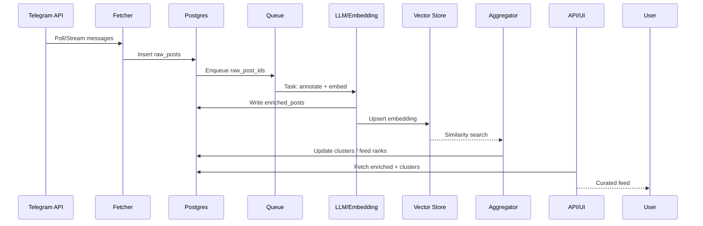

# InFocus — агрегатор новостей из Telegram с LLM-аннотацией

Проект собирает посты из выбранных Telegram-каналов, сохраняет их в Postgres, автоматически аннотирует (заголовок, теги, эмбеддинг) и собирает для пользователя информативную, неповторяющуюся ленту.

## Архитектура (общее представление)
```mermaid
flowchart LR
    subgraph Ingestion["Сбор данных"]
        A[Telegram API / прокси] --> B[Fetcher сервис]
    end

    subgraph Storage["Хранилище"]
        B --> C[(Postgres: raw_posts)]
        G[Vector Store (pgvector)]
    end

    subgraph Processing["Обработка"]
        C --> D[LLM Annotator: заголовок/теги]
        D --> E[Генератор эмбеддингов]
        E --> G
        D --> F[(Postgres: enriched_posts)]
    end

    subgraph Aggregation["Агрегация"]
        G --> H[Сходство / кластеризация]
        F --> H
        H --> I[Feed Builder: главные/группы/фильтры]
    end

    subgraph API/UI["Доступ"]
        I --> J[API / UI]
    end

    classDef vector fill:#d0f0ff,stroke:#0088cc,stroke-width:1px;
    class G vector;
```

## Этапы разработки

1) **Подготовка окружения**
   - Определить каналы, частоту опроса, бюджеты по LLM.
   - Выбрать стек (Python/Go/Node) + очередь задач (Celery/RQ/BullMQ).
   - Настроить Docker Compose: Postgres 15+ с pgvector, переменные `.env`.

2) **Каркас репозитория**
   - Структура модулей: `fetcher`, `processor`, `storage`, `api`.
   - Общие утилиты логирования и мониторинга.
   - Базовые тесты и линтеры.

3) **Сбор данных (ingest)**
   - Интеграция с Telegram API / MTProto, обработка rate limits.
   - Идемпотентность по `source_channel + source_msg_id`.
   - Запись сырых постов в `raw_posts` (текст, дата, медиа-ссылки).

4) **Аннотация и эмбеддинги**
   - Очередь задач для необработанных постов.
   - LLM для заголовка и тегов; эмбеддинги в pgvector.
   - Таблица `enriched_posts`: ссылки на `raw_posts`, статус обработки, временные метки.

5) **Кластеризация и ранжирование**
   - Сходство по косинусной мере; объединение в сюжеты.
   - Скоринговая модель: свежесть, авторитет канала, антирепост.
   - Фильтры «главное / неинтересное», пороги по качеству.

6) **API и UI**
   - Эндпоинты ленты, фильтры по тегам/каналам, детали поста или кластера.
   - Простая веб-страница или Telegram-бот для выдачи ленты.
   - Кэширование и пагинация.

7) **Надёжность и эксплуатация**
   - Ретраи, backpressure, dead-letter queue.
   - Метрики (Prometheus/Grafana), алерты, трейсинг.
   - Бэкапы и миграции (Alembic/Flyway).

8) **Качество и оптимизация**
   - Автотесты: модульные, интеграционные, e2e-пайплайн.
   - Кэширование ответов LLM/эмбеддингов, батчинг.
   - A/B проверки ранжирования и тюнинг порогов кластеризации.

## Поток обработки (детализированно)


## Набросок схемы данных
- `raw_posts(id, source_channel, source_msg_id, posted_at, text, media, created_at)`
- `enriched_posts(id, raw_post_id, title, tags[], embedding_ref, status, processed_at)`
- `clusters(id, centroid_embedding_ref, created_at)`
- `cluster_posts(cluster_id, enriched_post_id, score)`
- `feeds(user_id/segment, cluster_id, rank, created_at)`

## Минимальный план на MVP
- Поднять Postgres + pgvector через Docker Compose.
- Реализовать fetcher с идемпотентной записью в `raw_posts`.
- Добавить воркер LLM: заголовок, теги, эмбеддинг → `enriched_posts` + pgvector.
- Простая кластеризация по порогу косинусной близости и выдача ленты через API.

## Запуск Postgres локально
1. Скопируйте переменные окружения: `cp .env.example .env`.
2. Поднимите базу: `docker compose up -d postgres` (нужен установленный Docker).
3. Проверите схему: `psql "postgresql://$POSTGRES_USER:$POSTGRES_PASSWORD@$POSTGRES_HOST:$POSTGRES_PORT/$POSTGRES_DB" -c "\\dt"`.
4. База инициализируется скриптом `db/schema.sql`, который монтируется в контейнер при старте.

## Правила качества
- Логирование и трейсинг всех этапов (fetch, annotate, embed, rank).
- Контроль rate limits Telegram и LLM (батчинг, backoff).
- Единообразные тесты и миграции на каждый релиз.

## Базовый парсер Telegram-каналов
В репозитории добавлен минимальный модуль `infocus.telegram`, который можно использовать для первичного съёма постов из каналов Telegram.

Основные элементы:
- `TelethonClientFactory` — создаёт клиент Telethon на основе настроек или переменных окружения `TELEGRAM_API_ID`/`TELEGRAM_API_HASH`.
- `TelegramNewsParser` — асинхронно выгружает новые сообщения из списка каналов и нормализует их в структуру `TelegramMessage` (id, текст, дата, ссылка).

Пример использования:

```python
import asyncio
from infocus.telegram import ChannelConfig, TelegramNewsParser, TelethonClientFactory


async def main():
    factory = TelethonClientFactory.from_env()
    parser = TelegramNewsParser(factory)

    channels = [ChannelConfig("some_channel", limit=10)]
    messages = await parser.fetch_many(channels)
    for item in messages:
        print(item.to_dict())


if __name__ == "__main__":
    asyncio.run(main())
```

Зависимость: `telethon` (см. `requirements.txt`).
