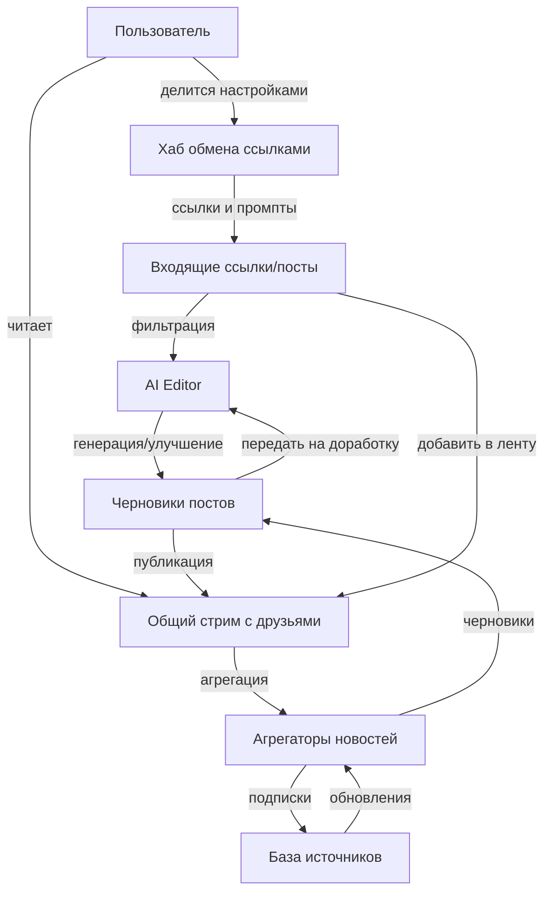
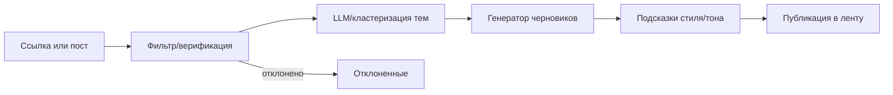
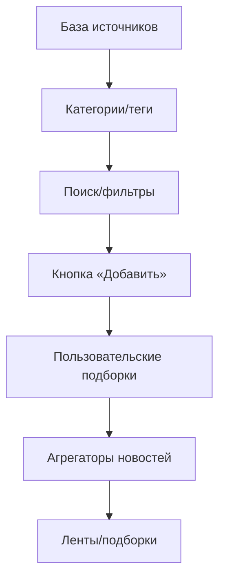
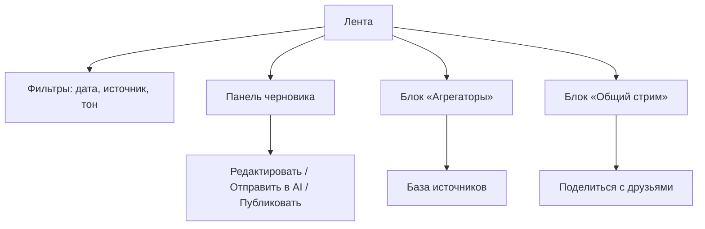

# System Diagrams and Frontend Concepts

Ниже — набор текстовых схем и примерных фронтенд-макетов, собранных по мотивам предоставленных иллюстраций. Все схемы в формате Mermaid, чтобы их можно было быстро просматривать в Markdown или конвертировать в изображения.

## 1. Общий контур сервиса

## 2. Конвейер работы с ссылкой/постом

## 3. Управление источниками и подписками

## 4. Фронтовые блоки (каркасные схемы)

## 5. Пример фронтенд-макета
Ниже — быстрый HTML/CSS-шаблон в том же стиле, что на схеме «Агрегат новостей». Его можно открыть локально (файл лежит в `examples/front-mockups/news_aggregator.html`) и доработать под реальный стек.

- Левая колонка — фильтры и статус подборки.
- Центральная колонка — список агрегаторов и превью постов.
- Правая колонка — черновик и действия публикации.

В шаблоне уже размечены кнопки «Отправить в AI», «Сделать» (генерация), «Опубликовать» и «Поделиться с друзьями».
